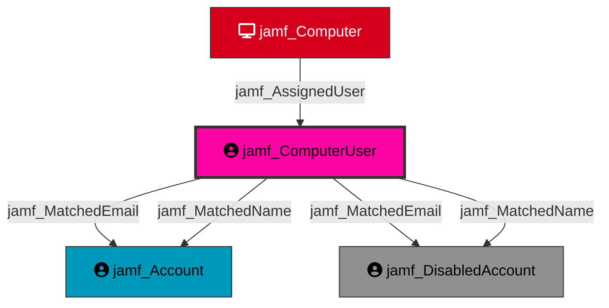

Represents a user assigned to a Jamf-managed computer. Computer users are derived from the location/user assignment on the computer record and serve as identity pivot nodes for linking physical device access to Jamf account permissions.

## Created by

`process_assigned_user_nodes` in `lib/preprocess.py`

## Edges

<Note>
The tables below list edges defined by the JamfHound extension only. Additional edges to or from this node may be created by other extensions.
</Note>

### Inbound Edges

| Edge Type | Source Node Types | Traversable | Description |
| --------- | ----------------- | ----------- | ----------- |
| [jamf_AssignedUser](/opengraph/extensions/jamfhound/reference/edges/jamf_assigneduser) | [jamf_Computer](/opengraph/extensions/jamfhound/reference/nodes/jamf_computer) | ✅ | Represents the user assignment relationship on a JAMF-managed computer. |
| [jamf_Contains](/opengraph/extensions/jamfhound/reference/edges/jamf_contains) | [jamf_Tenant](/opengraph/extensions/jamfhound/reference/nodes/jamf_tenant), [jamf_Site](/opengraph/extensions/jamfhound/reference/nodes/jamf_site) | ✅ | Represents a structural containment relationship where the source node contains the target resource. |

### Outbound Edges

| Edge Type | Destination Node Types | Traversable | Description |
| --------- | ---------------------- | ----------- | ----------- |
| [jamf_AZMatchedEmail](/opengraph/extensions/jamfhound/reference/edges/jamf_azmatchedemail) | [AZUser](https://bloodhound.specterops.io/resources/nodes/az-user) | ❌ | Represents a cross-platform identity correlation where the JAMF principal's email attribute matches an Azure AD account's email. |
| [jamf_MatchedEmail](/opengraph/extensions/jamfhound/reference/edges/jamf_matchedemail) | [jamf_Account](/opengraph/extensions/jamfhound/reference/nodes/jamf_account), [jamf_DisabledAccount](/opengraph/extensions/jamfhound/reference/nodes/jamf_disabledaccount) | ✅ | Represents an identity correlation where the JAMF computer user's email attribute matches the JAMF account's email. |
| [jamf_MatchedName](/opengraph/extensions/jamfhound/reference/edges/jamf_matchedname) | [jamf_Account](/opengraph/extensions/jamfhound/reference/nodes/jamf_account), [jamf_DisabledAccount](/opengraph/extensions/jamfhound/reference/nodes/jamf_disabledaccount) | ✅ | Represents an identity correlation where the JAMF computer user's displayname matches the JAMF account's name or displayname. |

## Properties

| Property Name | Data Type | Description |
|---|---|---|
| displayname | string | Display name of the user |
| name | string | Username or email of the user |
| email | string | Email address of the user |
| objectid | string | Unique identifier for the Computer User |
| computer | string | ID of the computer this user is assigned to |
| Tier | integer | Security tier classification |

## Relationship Diagram

