---
kind: "jamf_Group"
display_name: "Group"
is_display_kind: true
icon: "people-group"
color: "#F0FC03"
---

Represents a Jamf Pro account group. Groups aggregate accounts and hold shared permissions that are inherited by their members. Groups can have Full Access or Site Access privilege levels.

## Created by

`process_group_nodes` in `lib/preprocess.py`

## Edges

<Note>
The tables below list edges defined by the JamfHound extension only. Additional edges to or from this node may be created by other extensions.
</Note>

### Inbound Edges

| Edge Type | Source Node Types |
| --------- | ----------------- |
| [jamf_Contains](/opengraph/extensions/jamfhound/reference/edges/jamf_contains) | [jamf_Tenant](/opengraph/extensions/jamfhound/reference/nodes/jamf_tenant), [jamf_Site](/opengraph/extensions/jamfhound/reference/nodes/jamf_site) |
| [jamf_MemberOf](/opengraph/extensions/jamfhound/reference/edges/jamf_memberof) | [jamf_Account](/opengraph/extensions/jamfhound/reference/nodes/jamf_account), [jamf_DisabledAccount](/opengraph/extensions/jamfhound/reference/nodes/jamf_disabledaccount) |
| [jamf_SSO_Login](/opengraph/extensions/jamfhound/reference/edges/jamf_sso_login) | [jamf_SSOIntegration](/opengraph/extensions/jamfhound/reference/nodes/jamf_ssointegration) |

### Outbound Edges

| Edge Type | Destination Node Types |
| --------- | ---------------------- |
| [jamf_AdminToSite](/opengraph/extensions/jamfhound/reference/edges/jamf_admintosite) | [jamf_Site](/opengraph/extensions/jamfhound/reference/nodes/jamf_site) |
| [jamf_Create_API_Client_and_Assign_Role](/opengraph/extensions/jamfhound/reference/edges/jamf_create_api_client_and_assign_role) | [jamf_Tenant](/opengraph/extensions/jamfhound/reference/nodes/jamf_tenant) |
| [jamf_Create_API_Client_and_Create_Role](/opengraph/extensions/jamfhound/reference/edges/jamf_create_api_client_and_create_role) | [jamf_Tenant](/opengraph/extensions/jamfhound/reference/nodes/jamf_tenant) |
| [jamf_Create_API_Client_and_Update_Role](/opengraph/extensions/jamfhound/reference/edges/jamf_create_api_client_and_update_role) | [jamf_Tenant](/opengraph/extensions/jamfhound/reference/nodes/jamf_tenant) |
| [jamf_CreateAccounts](/opengraph/extensions/jamfhound/reference/edges/jamf_createaccounts) | [jamf_Tenant](/opengraph/extensions/jamfhound/reference/nodes/jamf_tenant) |
| [jamf_CreateAPIRoles](/opengraph/extensions/jamfhound/reference/edges/jamf_createapiroles) | [jamf_Tenant](/opengraph/extensions/jamfhound/reference/nodes/jamf_tenant) |
| [jamf_CreateComputerExtensions](/opengraph/extensions/jamfhound/reference/edges/jamf_createcomputerextensions) | [jamf_Computer](/opengraph/extensions/jamfhound/reference/nodes/jamf_computer) |
| [jamf_CreatePolicies](/opengraph/extensions/jamfhound/reference/edges/jamf_createpolicies) | [jamf_Computer](/opengraph/extensions/jamfhound/reference/nodes/jamf_computer) |
| [jamf_ScriptsNonTraversable](/opengraph/extensions/jamfhound/reference/edges/jamf_scriptsnontraversable) | [jamf_Tenant](/opengraph/extensions/jamfhound/reference/nodes/jamf_tenant) |
| [jamf_Update_API_Client_and_Assign_Role](/opengraph/extensions/jamfhound/reference/edges/jamf_update_api_client_and_assign_role) | [jamf_Tenant](/opengraph/extensions/jamfhound/reference/nodes/jamf_tenant) |
| [jamf_Update_API_Client_and_Create_Roles](/opengraph/extensions/jamfhound/reference/edges/jamf_update_api_client_and_create_roles) | [jamf_Tenant](/opengraph/extensions/jamfhound/reference/nodes/jamf_tenant) |
| [jamf_Update_API_Client_and_Update_Roles](/opengraph/extensions/jamfhound/reference/edges/jamf_update_api_client_and_update_roles) | [jamf_Tenant](/opengraph/extensions/jamfhound/reference/nodes/jamf_tenant) |
| [jamf_Update_Recurring_Scripts](/opengraph/extensions/jamfhound/reference/edges/jamf_update_recurring_scripts) | [jamf_Computer](/opengraph/extensions/jamfhound/reference/nodes/jamf_computer) |
| [jamf_UpdateAccounts](/opengraph/extensions/jamfhound/reference/edges/jamf_updateaccounts) | [jamf_Tenant](/opengraph/extensions/jamfhound/reference/nodes/jamf_tenant) |
| [jamf_UpdateAPIRoles](/opengraph/extensions/jamfhound/reference/edges/jamf_updateapiroles) | [jamf_Tenant](/opengraph/extensions/jamfhound/reference/nodes/jamf_tenant) |
| [jamf_UpdateComputerExtensions](/opengraph/extensions/jamfhound/reference/edges/jamf_updatecomputerextensions) | [jamf_Computer](/opengraph/extensions/jamfhound/reference/nodes/jamf_computer) |
| [jamf_UpdatePolicies](/opengraph/extensions/jamfhound/reference/edges/jamf_updatepolicies) | [jamf_Computer](/opengraph/extensions/jamfhound/reference/nodes/jamf_computer) |

## Properties

| Property Name | Data Type | Description |
|---|---|---|
| displayname | string | Display name of the group |
| privilegeSet | string | Privilege set assigned (Administrator, Custom, etc.) |
| objectid | string | Unique identifier for the Group |
| name | string | Name of the group |
| siteID | integer | ID of the site the group is assigned to |
| accessLevel | string | Access level (Full Access, Site Access) |
| Tier | integer | Security tier classification (0 for administrator groups) |
| privilegesJSSObjects | string[] | JSS Object permissions granted to the group |
| privilegesJSSActions | string[] | JSS Action permissions granted |
| privilegesJSSOSettings | string[] | JSS Settings permissions granted |
| members | string | Serialized list of group members |

## Edges

### Outbound Edges

| Edge Kind | Target Node | Traversable | Description |
|---|---|---|---|
| jamf_AdminTo | jamf_Tenant | Yes | Full admin control over tenant |
| jamf_AdminToSite | jamf_Site | Yes | Admin control over a site |
| jamf_UpdateAccounts | jamf_Tenant | Yes | Can update accounts |
| jamf_CreateAccounts | jamf_Tenant | Yes | Can create accounts |
| jamf_CreatePolicies | jamf_Computer | Yes | Can create policies for code execution |
| jamf_UpdatePolicies | jamf_Computer | Yes | Can update existing policies |
| jamf_ScriptsNonTraversable | jamf_Tenant, jamf_Site | No | Can create/update scripts |
| jamf_CreateComputerExtensions | jamf_Computer | Yes | Can create computer extension attributes |
| jamf_UpdateComputerExtensions | jamf_Computer | Yes | Can update computer extension attributes |
| jamf_Create_API_Client_and_Create_Role | jamf_Tenant | Yes | Create API client + create role |
| jamf_Create_API_Client_and_Update_Role | jamf_Tenant | Yes | Create API client + update role |
| jamf_Create_API_Client_and_Assign_Role | jamf_Tenant | Yes | Create API client + assign existing role |
| jamf_Update_API_Client_and_Update_Roles | jamf_Tenant | No | Update API client + update roles |
| jamf_Update_API_Client_and_Create_Roles | jamf_Tenant | No | Update API client + create roles |
| jamf_Update_API_Client_and_Assign_Role | jamf_Tenant | No | Update API client + assign existing role |
| jamf_CreateAPIRoles | jamf_Tenant | No | Create API roles |
| jamf_UpdateAPIRoles | jamf_Tenant | No | Update API roles |
| jamf_Update_Recurring_Scripts | jamf_Computer | Yes | Update recurring scripts for code execution |

### Inbound Edges

| Edge Kind | Source Node | Traversable | Description |
|---|---|---|---|
| jamf_Contains | jamf_Tenant, jamf_Site | Yes | Contained by tenant or site |
| jamf_MemberOf | jamf_Account, jamf_DisabledAccount | Yes | Accounts are members of this group |
| jamf_SSO_Login | jamf_SSOIntegration | Yes | SSO can authenticate as this group |

## Relationship Diagram

> **Note:** Some non-traversable edges have been omitted for clarity. The diagram shows all traversable edges and structurally important non-traversable edges. Omitted edges include: `jamf_Update_API_Client_and_Update_Roles`, `jamf_Update_API_Client_and_Create_Roles`, `jamf_Update_API_Client_and_Assign_Role`, `jamf_CreateAPIRoles`, and `jamf_UpdateAPIRoles`.

```mermaid
flowchart TD
    Group[fa:fa-people-group jamf_Group]
    Tenant[fa:fa-cloud jamf_Tenant]
    Site[fa:fa-circle-nodes jamf_Site]
    Computer[fa:fa-display jamf_Computer]
    Account[fa:fa-circle-user jamf_Account]
    DisabledAccount[fa:fa-circle-user jamf_DisabledAccount]
    SSOIntegration[fa:fa-address-card jamf_SSOIntegration]

    Group -->|jamf_AdminTo| Tenant
    Group -->|jamf_AdminToSite| Site
    Group -->|jamf_UpdateAccounts| Tenant
    Group -->|jamf_CreateAccounts| Tenant
    Group -->|jamf_CreatePolicies| Computer
    Group -->|jamf_UpdatePolicies| Computer
    Group -->|jamf_CreateComputerExtensions| Computer
    Group -->|jamf_UpdateComputerExtensions| Computer
    Group -->|jamf_Create_API_Client_and_Create_Role| Tenant
    Group -->|jamf_Create_API_Client_and_Update_Role| Tenant
    Group -->|jamf_Create_API_Client_and_Assign_Role| Tenant
    Group -->|jamf_Update_Recurring_Scripts| Computer
    Group -.->|jamf_ScriptsNonTraversable| Tenant
    Group -.->|jamf_ScriptsNonTraversable| Site

    Tenant -->|jamf_Contains| Group
    Site -->|jamf_Contains| Group
    Account -->|jamf_MemberOf| Group
    DisabledAccount -->|jamf_MemberOf| Group
    SSOIntegration -->|jamf_SSO_Login| Group

    style Group fill:#F0FC03,stroke:#333,stroke-width:3px,color:#000
    style Tenant fill:#00C08D,stroke:#333,stroke-width:1px,color:#000
    style Site fill:#D67500,stroke:#333,stroke-width:1px,color:#000
    style Computer fill:#D6001C,stroke:#333,stroke-width:1px,color:#fff
    style Account fill:#0098BB,stroke:#333,stroke-width:1px,color:#000
    style DisabledAccount fill:#909090,stroke:#333,stroke-width:1px,color:#000
    style SSOIntegration fill:#FFFFFF,stroke:#333,stroke-width:1px,color:#000
```

