Represents a Jamf Pro account group. Groups aggregate accounts and hold shared permissions that are inherited by their members. Groups can have Full Access or Site Access privilege levels.

## Created by

`process_group_nodes` in `lib/preprocess.py`

## Edges

<Note>
The tables below list edges defined by the JamfHound extension only. Additional edges to or from this node may be created by other extensions.
</Note>

### Inbound Edges

| Edge Type | Source Node Types | Traversable | Description |
| --------- | ----------------- | ----------- | ----------- |
| [jamf_Contains](/opengraph/extensions/jamfhound/reference/edges/jamf_contains) | [jamf_Tenant](/opengraph/extensions/jamfhound/reference/nodes/jamf_tenant), [jamf_Site](/opengraph/extensions/jamfhound/reference/nodes/jamf_site) | ✅ | Represents a structural containment relationship where the source node contains the target resource. |
| [jamf_MemberOf](/opengraph/extensions/jamfhound/reference/edges/jamf_memberof) | [jamf_Account](/opengraph/extensions/jamfhound/reference/nodes/jamf_account), [jamf_DisabledAccount](/opengraph/extensions/jamfhound/reference/nodes/jamf_disabledaccount) | ✅ | Represents group membership where the source inherits the group's permissions and assignments. |
| [jamf_SSO_Login](/opengraph/extensions/jamfhound/reference/edges/jamf_sso_login) | [jamf_SSOIntegration](/opengraph/extensions/jamfhound/reference/nodes/jamf_ssointegration) | ✅ | Represents the ability of an SSO identity provider to authenticate as and inherit the privileges of JAMF accounts and groups. |
| [jamf_Update_SSO_Settings](/opengraph/extensions/jamfhound/reference/edges/jamf_update_sso_settings) | [jamf_Account](/opengraph/extensions/jamfhound/reference/nodes/jamf_account), [jamf_DisabledAccount](/opengraph/extensions/jamfhound/reference/nodes/jamf_disabledaccount), [jamf_Group](/opengraph/extensions/jamfhound/reference/nodes/jamf_group), [jamf_ApiClient](/opengraph/extensions/jamfhound/reference/nodes/jamf_apiclient), [jamf_DisabledApiClient](/opengraph/extensions/jamfhound/reference/nodes/jamf_disabledapiclient) | ✅ | Represents the ability to update or enable SSO settings in the tenant to change authentication to inherit the privileges of JAMF accounts and groups. |

### Outbound Edges

| Edge Type | Destination Node Types | Traversable | Description |
| --------- | ---------------------- | ----------- | ----------- |
| [jamf_AdminToSite](/opengraph/extensions/jamfhound/reference/edges/jamf_admintosite) | [jamf_Site](/opengraph/extensions/jamfhound/reference/nodes/jamf_site) | ✅ | The source has administrative control over the site and all resources controlled by the site. This includes creating policies that impact resources of the site, send or clear MDM commands, remotely administer site devices and computers, create computer objects for the site. |
| [jamf_Create_API_Client_and_Assign_Role](/opengraph/extensions/jamfhound/reference/edges/jamf_create_api_client_and_assign_role) | [jamf_Tenant](/opengraph/extensions/jamfhound/reference/nodes/jamf_tenant) | ✅ | Represents a privilege escalation path where the source possesses 'Create API Integrations' permission and at least one role exists allowing the creation of new API clients to assume existing role permissions. |
| [jamf_Create_API_Client_and_Create_Role](/opengraph/extensions/jamfhound/reference/edges/jamf_create_api_client_and_create_role) | [jamf_Tenant](/opengraph/extensions/jamfhound/reference/nodes/jamf_tenant) | ✅ | Represents a combined privilege escalation path, where the source possesses the 'Create API Integrations' and 'Create API Roles' permissions, that allow the creation of new API clients with any permissions in newly assigned roles and retrieving API client credentials to authenticate. |
| [jamf_Create_API_Client_and_Update_Role](/opengraph/extensions/jamfhound/reference/edges/jamf_create_api_client_and_update_role) | [jamf_Tenant](/opengraph/extensions/jamfhound/reference/nodes/jamf_tenant) | ✅ | Represents a combined privilege escalation path where the source possesses 'Create API Integrations' and 'Update API Roles' permissions and at least one API role exists allowing the creation of new API clients to assume roles, modifying the permissions of existing roles, and retrieving API client credentials. |
| [jamf_CreateAccounts](/opengraph/extensions/jamfhound/reference/edges/jamf_createaccounts) | [jamf_Tenant](/opengraph/extensions/jamfhound/reference/nodes/jamf_tenant) | ✅ | Represents possession of the 'Create Accounts' JSS Object permission which allows creating new accounts, including administrators, as well as creating new groups with any permissions. |
| [jamf_CreateAPIRoles](/opengraph/extensions/jamfhound/reference/edges/jamf_createapiroles) | [jamf_Tenant](/opengraph/extensions/jamfhound/reference/nodes/jamf_tenant) | ❌ | Represents the ability to create API roles in the JAMF tenant. Non-traversable because creating roles without the ability to create or update API integrations does not provide a credential retrieval mechanism. |
| [jamf_CreateComputerExtensions](/opengraph/extensions/jamfhound/reference/edges/jamf_createcomputerextensions) | [jamf_Computer](/opengraph/extensions/jamfhound/reference/nodes/jamf_computer) | ✅ | Represents the ability to create computer extension attributes which can execute code on all computers in the JAMF tenant. |
| [jamf_CreatePolicies](/opengraph/extensions/jamfhound/reference/edges/jamf_createpolicies) | [jamf_Computer](/opengraph/extensions/jamfhound/reference/nodes/jamf_computer) | ✅ | Represents possession of the 'Create Policies' JSSObject privilege allowing code execution on target computers. |
| [jamf_ScriptsNonTraversable](/opengraph/extensions/jamfhound/reference/edges/jamf_scriptsnontraversable) | [jamf_Tenant](/opengraph/extensions/jamfhound/reference/nodes/jamf_tenant) | ❌ | Represents the ability to create or update scripts on the target. This edge is non-traversable because script creation/modification alone does not enable code execution. |
| [jamf_Update_API_Client_and_Assign_Role](/opengraph/extensions/jamfhound/reference/edges/jamf_update_api_client_and_assign_role) | [jamf_Tenant](/opengraph/extensions/jamfhound/reference/nodes/jamf_tenant) | ❌ | Represents posession of the 'Update API Integrations' permission and at least one role has been created in the tenant. Combined these allow updating existing API clients to assume the permissions of existing roles. Non-traversable because these permissions alone cannot retrieve API client credentials. |
| [jamf_Update_API_Client_and_Create_Roles](/opengraph/extensions/jamfhound/reference/edges/jamf_update_api_client_and_create_roles) | [jamf_Tenant](/opengraph/extensions/jamfhound/reference/nodes/jamf_tenant) | ❌ | Represents combined possession of 'Update API Integrations' and 'Create API Roles' permissions and at least one API client exists in the tenant allowing updates of existing API clients and assigning new roles created with any included permissions. Non-traversable because these permissions alone cannot retrieve API client credentials. |
| [jamf_Update_API_Client_and_Update_Roles](/opengraph/extensions/jamfhound/reference/edges/jamf_update_api_client_and_update_roles) | [jamf_Tenant](/opengraph/extensions/jamfhound/reference/nodes/jamf_tenant) | ❌ | Represents combined possession of 'Update API Integrations' and 'Update API Roles' permissions and at least one Api Client and Role exist in the tenant allowing updates of existing API clients with any permissions by updating existing roles. Non-traversable because these permissions alone cannot retrieve API client credentials. |
| [jamf_Update_Recurring_Scripts](/opengraph/extensions/jamfhound/reference/edges/jamf_update_recurring_scripts) | [jamf_Computer](/opengraph/extensions/jamfhound/reference/nodes/jamf_computer) | ✅ | Represents a code execution path where the source has 'Update Scripts' JSSObject permission and there are scripts configured to run repeatedly on target computers via enabled policies allowing code execution. |
| [jamf_Update_SSO_Settings](/opengraph/extensions/jamfhound/reference/edges/jamf_update_sso_settings) | [jamf_SSOIntegration](/opengraph/extensions/jamfhound/reference/nodes/jamf_ssointegration), [jamf_Account](/opengraph/extensions/jamfhound/reference/nodes/jamf_account), [jamf_DisabledAccount](/opengraph/extensions/jamfhound/reference/nodes/jamf_disabledaccount), [jamf_Group](/opengraph/extensions/jamfhound/reference/nodes/jamf_group) | ✅ | Represents the ability to update or enable SSO settings in the tenant to change authentication to inherit the privileges of JAMF accounts and groups. |
| [jamf_UpdateAccounts](/opengraph/extensions/jamfhound/reference/edges/jamf_updateaccounts) | [jamf_Tenant](/opengraph/extensions/jamfhound/reference/nodes/jamf_tenant) | ✅ | Represents possession of the 'Update Accounts' JSS Object permission which allows altering the passwords, enabled status, permissions, and memberships of existing accounts or groups. |
| [jamf_UpdateAPIRoles](/opengraph/extensions/jamfhound/reference/edges/jamf_updateapiroles) | [jamf_Tenant](/opengraph/extensions/jamfhound/reference/nodes/jamf_tenant) | ❌ | Represents the ability to update existing API roles in the JAMF tenant. Non-traversable because modifying roles without the ability to create or update API clients does not provide a credential retrieval mechanism. |
| [jamf_UpdateComputerExtensions](/opengraph/extensions/jamfhound/reference/edges/jamf_updatecomputerextensions) | [jamf_Computer](/opengraph/extensions/jamfhound/reference/nodes/jamf_computer) | ✅ | Represents the ability to update existing computer extension attributes and at least one extension attribute exists, allowing execution of code on all computers in the JAMF tenant during inventory collection. |
| [jamf_UpdatePolicies](/opengraph/extensions/jamfhound/reference/edges/jamf_updatepolicies) | [jamf_Computer](/opengraph/extensions/jamfhound/reference/nodes/jamf_computer) | ✅ | Represents possession of the 'Update Policies' JSSObject privilege and at least one policy already exists in the tenant, allowing modification of existing policies for code execution on target computers. |

## Properties

| Property Name | Data Type | Description |
|---|---|---|
| displayname | string | Display name of the group |
| privilegeSet | string | Privilege set assigned (Administrator, Custom, etc.) |
| objectid | string | Unique identifier for the Group |
| name | string | Name of the group |
| siteID | integer | ID of the site the group is assigned to |
| accessLevel | string | Access level (Full Access, Site Access) |
| Tier | integer | Security tier classification (0 for administrator groups) |
| privilegesJSSObjects | string[] | JSS Object permissions granted to the group |
| privilegesJSSActions | string[] | JSS Action permissions granted |
| privilegesJSSOSettings | string[] | JSS Settings permissions granted |
| members | string | Serialized list of group members |

## Relationship Diagram

> **Note:** Some non-traversable edges have been omitted for clarity. The diagram shows all traversable edges and structurally important non-traversable edges. Omitted edges include: `jamf_Update_API_Client_and_Update_Roles`, `jamf_Update_API_Client_and_Create_Roles`, `jamf_Update_API_Client_and_Assign_Role`, `jamf_CreateAPIRoles`, and `jamf_UpdateAPIRoles`.

```mermaid
flowchart TD
    Group[fa:fa-people-group jamf_Group]
    Tenant[fa:fa-cloud jamf_Tenant]
    Site[fa:fa-circle-nodes jamf_Site]
    Computer[fa:fa-display jamf_Computer]
    Account[fa:fa-circle-user jamf_Account]
    DisabledAccount[fa:fa-circle-user jamf_DisabledAccount]
    SSOIntegration[fa:fa-address-card jamf_SSOIntegration]

    Group -->|jamf_AdminTo| Tenant
    Group -->|jamf_AdminToSite| Site
    Group -->|jamf_UpdateAccounts| Tenant
    Group -->|jamf_CreateAccounts| Tenant
    Group -->|jamf_CreatePolicies| Computer
    Group -->|jamf_UpdatePolicies| Computer
    Group -->|jamf_CreateComputerExtensions| Computer
    Group -->|jamf_UpdateComputerExtensions| Computer
    Group -->|jamf_Create_API_Client_and_Create_Role| Tenant
    Group -->|jamf_Create_API_Client_and_Update_Role| Tenant
    Group -->|jamf_Create_API_Client_and_Assign_Role| Tenant
    Group -->|jamf_Update_Recurring_Scripts| Computer
    Group -.->|jamf_ScriptsNonTraversable| Tenant
    Group -.->|jamf_ScriptsNonTraversable| Site

    Tenant -->|jamf_Contains| Group
    Site -->|jamf_Contains| Group
    Account -->|jamf_MemberOf| Group
    DisabledAccount -->|jamf_MemberOf| Group
    SSOIntegration -->|jamf_SSO_Login| Group

    style Group fill:#F0FC03,stroke:#333,stroke-width:3px,color:#000
    style Tenant fill:#00C08D,stroke:#333,stroke-width:1px,color:#000
    style Site fill:#D67500,stroke:#333,stroke-width:1px,color:#000
    style Computer fill:#D6001C,stroke:#333,stroke-width:1px,color:#fff
    style Account fill:#0098BB,stroke:#333,stroke-width:1px,color:#000
    style DisabledAccount fill:#909090,stroke:#333,stroke-width:1px,color:#000
    style SSOIntegration fill:#FFFFFF,stroke:#333,stroke-width:1px,color:#000
```

