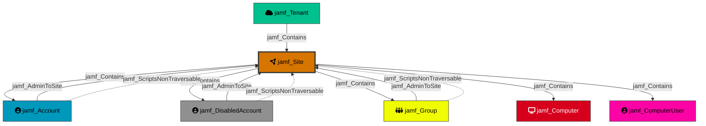

---
kind: "jamf_Site"
display_name: "Site"
is_display_kind: true
icon: "circle-nodes"
color: "#D67500"
---

Represents a Jamf Pro site. Sites are organizational containers that segment resources within a Jamf tenant. Accounts and resources can be scoped to specific sites, limiting their access and management boundaries.

## Created by

`process_site_nodes` in `lib/preprocess.py`

## Edges

<Note>
The tables below list edges defined by the JamfHound extension only. Additional edges to or from this node may be created by other extensions.
</Note>

### Inbound Edges

| Edge Type | Source Node Types |
| --------- | ----------------- |
| [jamf_AdminToSite](/opengraph/extensions/jamfhound/reference/edges/jamf_admintosite) | [jamf_Account](/opengraph/extensions/jamfhound/reference/nodes/jamf_account), [jamf_DisabledAccount](/opengraph/extensions/jamfhound/reference/nodes/jamf_disabledaccount), [jamf_Group](/opengraph/extensions/jamfhound/reference/nodes/jamf_group) |
| [jamf_Contains](/opengraph/extensions/jamfhound/reference/edges/jamf_contains) | [jamf_Tenant](/opengraph/extensions/jamfhound/reference/nodes/jamf_tenant), [jamf_Site](/opengraph/extensions/jamfhound/reference/nodes/jamf_site) |

### Outbound Edges

| Edge Type | Destination Node Types |
| --------- | ---------------------- |
| [jamf_Contains](/opengraph/extensions/jamfhound/reference/edges/jamf_contains) | [jamf_Account](/opengraph/extensions/jamfhound/reference/nodes/jamf_account), [jamf_DisabledAccount](/opengraph/extensions/jamfhound/reference/nodes/jamf_disabledaccount), [jamf_Group](/opengraph/extensions/jamfhound/reference/nodes/jamf_group), [jamf_Computer](/opengraph/extensions/jamfhound/reference/nodes/jamf_computer), [jamf_ComputerUser](/opengraph/extensions/jamfhound/reference/nodes/jamf_computeruser), [jamf_Site](/opengraph/extensions/jamfhound/reference/nodes/jamf_site), [jamf_ApiClient](/opengraph/extensions/jamfhound/reference/nodes/jamf_apiclient), [jamf_DisabledApiClient](/opengraph/extensions/jamfhound/reference/nodes/jamf_disabledapiclient), [jamf_SSOIntegration](/opengraph/extensions/jamfhound/reference/nodes/jamf_ssointegration) |

## Properties

| Property Name | Data Type | Description |
|---|---|---|
| name | string | Name of the site |
| objectid | string | Unique identifier for the Site |
| displayname | string | Display name of the site |
| siteID | integer | Jamf site ID |
| Tier | integer | Security tier classification |

## Edges

### Outbound Edges

| Edge Kind | Target Node | Traversable | Description |
|---|---|---|---|
| jamf_Contains | jamf_Account, jamf_DisabledAccount, jamf_Group, jamf_Computer, jamf_ComputerUser | Yes | Site contains scoped resources |

### Inbound Edges

| Edge Kind | Source Node | Traversable | Description |
|---|---|---|---|
| jamf_Contains | jamf_Tenant | Yes | Contained by the tenant |
| jamf_AdminToSite | jamf_Account, jamf_DisabledAccount, jamf_Group | Yes | Account has admin control over this site |
| jamf_ScriptsNonTraversable | jamf_Account, jamf_DisabledAccount, jamf_Group | No | Account can create/update scripts on this site |

## Relationship Diagram

