Represents the top-level Jamf Pro tenant environment. This is the root container node for all Jamf resources.

## Created by

`prepare_graph` in `lib/preprocess.py`

## Edges

<Note>
The tables below list edges defined by the JamfHound extension only. Additional edges to or from this node may be created by other extensions.
</Note>

### Inbound Edges

| Edge Type | Source Node Types | Traversable | Description |
| --------- | ----------------- | ----------- | ----------- |
| [jamf_AdminTo](/opengraph/extensions/jamfhound/reference/edges/jamf_adminto) | [jamf_Account](/opengraph/extensions/jamfhound/reference/nodes/jamf_account), [jamf_DisabledAccount](/opengraph/extensions/jamfhound/reference/nodes/jamf_disabledaccount) | ✅ | Represents full administrative control over the target and all resources controlled by the target. |
| [jamf_Create_API_Client_and_Assign_Role](/opengraph/extensions/jamfhound/reference/edges/jamf_create_api_client_and_assign_role) | [jamf_Account](/opengraph/extensions/jamfhound/reference/nodes/jamf_account), [jamf_DisabledAccount](/opengraph/extensions/jamfhound/reference/nodes/jamf_disabledaccount), [jamf_Group](/opengraph/extensions/jamfhound/reference/nodes/jamf_group), [jamf_ApiClient](/opengraph/extensions/jamfhound/reference/nodes/jamf_apiclient), [jamf_DisabledApiClient](/opengraph/extensions/jamfhound/reference/nodes/jamf_disabledapiclient) | ✅ | Represents a privilege escalation path where the source possesses 'Create API Integrations' permission and at least one role exists allowing the creation of new API clients to assume existing role permissions. |
| [jamf_Create_API_Client_and_Create_Role](/opengraph/extensions/jamfhound/reference/edges/jamf_create_api_client_and_create_role) | [jamf_Account](/opengraph/extensions/jamfhound/reference/nodes/jamf_account), [jamf_DisabledAccount](/opengraph/extensions/jamfhound/reference/nodes/jamf_disabledaccount), [jamf_Group](/opengraph/extensions/jamfhound/reference/nodes/jamf_group), [jamf_ApiClient](/opengraph/extensions/jamfhound/reference/nodes/jamf_apiclient), [jamf_DisabledApiClient](/opengraph/extensions/jamfhound/reference/nodes/jamf_disabledapiclient) | ✅ | Represents a combined privilege escalation path, where the source possesses the 'Create API Integrations' and 'Create API Roles' permissions, that allow the creation of new API clients with any permissions in newly assigned roles and retrieving API client credentials to authenticate. |
| [jamf_Create_API_Client_and_Update_Role](/opengraph/extensions/jamfhound/reference/edges/jamf_create_api_client_and_update_role) | [jamf_Account](/opengraph/extensions/jamfhound/reference/nodes/jamf_account), [jamf_DisabledAccount](/opengraph/extensions/jamfhound/reference/nodes/jamf_disabledaccount), [jamf_Group](/opengraph/extensions/jamfhound/reference/nodes/jamf_group), [jamf_ApiClient](/opengraph/extensions/jamfhound/reference/nodes/jamf_apiclient), [jamf_DisabledApiClient](/opengraph/extensions/jamfhound/reference/nodes/jamf_disabledapiclient) | ✅ | Represents a combined privilege escalation path where the source possesses 'Create API Integrations' and 'Update API Roles' permissions and at least one API role exists allowing the creation of new API clients to assume roles, modifying the permissions of existing roles, and retrieving API client credentials. |
| [jamf_CreateAccounts](/opengraph/extensions/jamfhound/reference/edges/jamf_createaccounts) | [jamf_Account](/opengraph/extensions/jamfhound/reference/nodes/jamf_account), [jamf_DisabledAccount](/opengraph/extensions/jamfhound/reference/nodes/jamf_disabledaccount), [jamf_Group](/opengraph/extensions/jamfhound/reference/nodes/jamf_group), [jamf_ApiClient](/opengraph/extensions/jamfhound/reference/nodes/jamf_apiclient), [jamf_DisabledApiClient](/opengraph/extensions/jamfhound/reference/nodes/jamf_disabledapiclient) | ✅ | Represents possession of the 'Create Accounts' JSS Object permission which allows creating new accounts, including administrators, as well as creating new groups with any permissions. |
| [jamf_CreateAPIRoles](/opengraph/extensions/jamfhound/reference/edges/jamf_createapiroles) | [jamf_Account](/opengraph/extensions/jamfhound/reference/nodes/jamf_account), [jamf_DisabledAccount](/opengraph/extensions/jamfhound/reference/nodes/jamf_disabledaccount), [jamf_Group](/opengraph/extensions/jamfhound/reference/nodes/jamf_group), [jamf_ApiClient](/opengraph/extensions/jamfhound/reference/nodes/jamf_apiclient), [jamf_DisabledApiClient](/opengraph/extensions/jamfhound/reference/nodes/jamf_disabledapiclient) | ❌ | Represents the ability to create API roles in the JAMF tenant. Non-traversable because creating roles without the ability to create or update API integrations does not provide a credential retrieval mechanism. |
| [jamf_ScriptsNonTraversable](/opengraph/extensions/jamfhound/reference/edges/jamf_scriptsnontraversable) | [jamf_Account](/opengraph/extensions/jamfhound/reference/nodes/jamf_account), [jamf_DisabledAccount](/opengraph/extensions/jamfhound/reference/nodes/jamf_disabledaccount), [jamf_Group](/opengraph/extensions/jamfhound/reference/nodes/jamf_group), [jamf_ApiClient](/opengraph/extensions/jamfhound/reference/nodes/jamf_apiclient), [jamf_DisabledApiClient](/opengraph/extensions/jamfhound/reference/nodes/jamf_disabledapiclient) | ❌ | Represents the ability to create or update scripts on the target. This edge is non-traversable because script creation/modification alone does not enable code execution. |
| [jamf_Update_API_Client_and_Assign_Role](/opengraph/extensions/jamfhound/reference/edges/jamf_update_api_client_and_assign_role) | [jamf_Account](/opengraph/extensions/jamfhound/reference/nodes/jamf_account), [jamf_DisabledAccount](/opengraph/extensions/jamfhound/reference/nodes/jamf_disabledaccount), [jamf_Group](/opengraph/extensions/jamfhound/reference/nodes/jamf_group) | ❌ | Represents posession of the 'Update API Integrations' permission and at least one role has been created in the tenant. Combined these allow updating existing API clients to assume the permissions of existing roles. Non-traversable because these permissions alone cannot retrieve API client credentials. |
| [jamf_Update_API_Client_and_Create_Roles](/opengraph/extensions/jamfhound/reference/edges/jamf_update_api_client_and_create_roles) | [jamf_Account](/opengraph/extensions/jamfhound/reference/nodes/jamf_account), [jamf_DisabledAccount](/opengraph/extensions/jamfhound/reference/nodes/jamf_disabledaccount), [jamf_Group](/opengraph/extensions/jamfhound/reference/nodes/jamf_group) | ❌ | Represents combined possession of 'Update API Integrations' and 'Create API Roles' permissions and at least one API client exists in the tenant allowing updates of existing API clients and assigning new roles created with any included permissions. Non-traversable because these permissions alone cannot retrieve API client credentials. |
| [jamf_Update_API_Client_and_Update_Roles](/opengraph/extensions/jamfhound/reference/edges/jamf_update_api_client_and_update_roles) | [jamf_Account](/opengraph/extensions/jamfhound/reference/nodes/jamf_account), [jamf_DisabledAccount](/opengraph/extensions/jamfhound/reference/nodes/jamf_disabledaccount), [jamf_Group](/opengraph/extensions/jamfhound/reference/nodes/jamf_group) | ❌ | Represents combined possession of 'Update API Integrations' and 'Update API Roles' permissions and at least one Api Client and Role exist in the tenant allowing updates of existing API clients with any permissions by updating existing roles. Non-traversable because these permissions alone cannot retrieve API client credentials. |
| [jamf_Update_Roles_Assigned_To_Self](/opengraph/extensions/jamfhound/reference/edges/jamf_update_roles_assigned_to_self) | [jamf_ApiClient](/opengraph/extensions/jamfhound/reference/nodes/jamf_apiclient), [jamf_DisabledApiClient](/opengraph/extensions/jamfhound/reference/nodes/jamf_disabledapiclient) | ✅ | Represents an API client possessing the 'Update API Roles' permission which allows updating existing API roles with any permissions, including roles assigned to itself. |
| [jamf_Update_Self_and_Assign_Roles](/opengraph/extensions/jamfhound/reference/edges/jamf_update_self_and_assign_roles) | [jamf_ApiClient](/opengraph/extensions/jamfhound/reference/nodes/jamf_apiclient), [jamf_DisabledApiClient](/opengraph/extensions/jamfhound/reference/nodes/jamf_disabledapiclient) | ✅ | Represents an API client that possesses 'Update API Integrations' permission and at least one role exists, allowing the client to assume the permissions of existing roles. |
| [jamf_Update_Self_and_Create_Roles](/opengraph/extensions/jamfhound/reference/edges/jamf_update_self_and_create_roles) | [jamf_ApiClient](/opengraph/extensions/jamfhound/reference/nodes/jamf_apiclient), [jamf_DisabledApiClient](/opengraph/extensions/jamfhound/reference/nodes/jamf_disabledapiclient) | ✅ | Represents an API client that possesses 'Update API Integrations' and 'Create API Roles' permissions, allowing the client to assign new roles with any included permissions. |
| [jamf_Update_Self_and_Update_Roles](/opengraph/extensions/jamfhound/reference/edges/jamf_update_self_and_update_roles) | [jamf_ApiClient](/opengraph/extensions/jamfhound/reference/nodes/jamf_apiclient), [jamf_DisabledApiClient](/opengraph/extensions/jamfhound/reference/nodes/jamf_disabledapiclient) | ✅ | Represents an API client that possesses 'Update API Integrations' and 'Update API Roles' permissions and at least one role exists, allowing the client to assign any permissions by modifying existing roles. |
| [jamf_UpdateAccounts](/opengraph/extensions/jamfhound/reference/edges/jamf_updateaccounts) | [jamf_Account](/opengraph/extensions/jamfhound/reference/nodes/jamf_account), [jamf_DisabledAccount](/opengraph/extensions/jamfhound/reference/nodes/jamf_disabledaccount), [jamf_Group](/opengraph/extensions/jamfhound/reference/nodes/jamf_group), [jamf_ApiClient](/opengraph/extensions/jamfhound/reference/nodes/jamf_apiclient), [jamf_DisabledApiClient](/opengraph/extensions/jamfhound/reference/nodes/jamf_disabledapiclient) | ✅ | Represents possession of the 'Update Accounts' JSS Object permission which allows altering the passwords, enabled status, permissions, and memberships of existing accounts or groups. |
| [jamf_UpdateAPIRoles](/opengraph/extensions/jamfhound/reference/edges/jamf_updateapiroles) | [jamf_Account](/opengraph/extensions/jamfhound/reference/nodes/jamf_account), [jamf_DisabledAccount](/opengraph/extensions/jamfhound/reference/nodes/jamf_disabledaccount), [jamf_Group](/opengraph/extensions/jamfhound/reference/nodes/jamf_group) | ❌ | Represents the ability to update existing API roles in the JAMF tenant. Non-traversable because modifying roles without the ability to create or update API clients does not provide a credential retrieval mechanism. |

### Outbound Edges

| Edge Type | Destination Node Types | Traversable | Description |
| --------- | ---------------------- | ----------- | ----------- |
| [jamf_Contains](/opengraph/extensions/jamfhound/reference/edges/jamf_contains) | [jamf_Account](/opengraph/extensions/jamfhound/reference/nodes/jamf_account), [jamf_DisabledAccount](/opengraph/extensions/jamfhound/reference/nodes/jamf_disabledaccount), [jamf_Group](/opengraph/extensions/jamfhound/reference/nodes/jamf_group), [jamf_Computer](/opengraph/extensions/jamfhound/reference/nodes/jamf_computer), [jamf_ComputerUser](/opengraph/extensions/jamfhound/reference/nodes/jamf_computeruser), [jamf_Site](/opengraph/extensions/jamfhound/reference/nodes/jamf_site), [jamf_ApiClient](/opengraph/extensions/jamfhound/reference/nodes/jamf_apiclient), [jamf_DisabledApiClient](/opengraph/extensions/jamfhound/reference/nodes/jamf_disabledapiclient), [jamf_SSOIntegration](/opengraph/extensions/jamfhound/reference/nodes/jamf_ssointegration) | ✅ | Represents a structural containment relationship where the source node contains the target resource. |

## Properties

| Property Name | Data Type | Description |
|---|---|---|
| name | string | Domain name of the Jamf Pro tenant |
| type | string | Hosting type (cloud-hosted or on-premesis) |
| objectid | string | Unique identifier matching the tenant name |
| displayname | string | Display name of the Tenant |
| Tier | integer | Security tier classification |

## Relationship Diagram

> **Note:** Some non-traversable edges have been omitted for clarity. The diagram shows all traversable edges and structurally important non-traversable edges. Omitted edges include: `jamf_Update_API_Client_and_Update_Roles`, `jamf_Update_API_Client_and_Create_Roles`, `jamf_Update_API_Client_and_Assign_Role`, `jamf_CreateAPIRoles`, and `jamf_UpdateAPIRoles`.

```mermaid
flowchart TD
    Tenant[fa:fa-cloud jamf_Tenant]
    Account[fa:fa-circle-user jamf_Account]
    DisabledAccount[fa:fa-circle-user jamf_DisabledAccount]
    Group[fa:fa-people-group jamf_Group]
    ApiClient[fa:fa-user-gear jamf_ApiClient]
    DisabledApiClient[fa:fa-user-gear jamf_DisabledApiClient]

    Tenant -->|jamf_Contains| Tenant
    Account -->|jamf_AdminTo| Tenant
    DisabledAccount -->|jamf_AdminTo| Tenant
    Account -->|jamf_UpdateAccounts| Tenant
    DisabledAccount -->|jamf_UpdateAccounts| Tenant
    Group -->|jamf_UpdateAccounts| Tenant
    ApiClient -->|jamf_UpdateAccounts| Tenant
    DisabledApiClient -->|jamf_UpdateAccounts| Tenant
    Account -->|jamf_CreateAccounts| Tenant
    DisabledAccount -->|jamf_CreateAccounts| Tenant
    Group -->|jamf_CreateAccounts| Tenant
    ApiClient -->|jamf_CreateAccounts| Tenant
    DisabledApiClient -->|jamf_CreateAccounts| Tenant
    Account -->|jamf_Create_API_Client_and_Create_Role| Tenant
    Group -->|jamf_Create_API_Client_and_Create_Role| Tenant
    ApiClient -->|jamf_Create_API_Client_and_Create_Role| Tenant
    Account -->|jamf_Create_API_Client_and_Update_Role| Tenant
    Group -->|jamf_Create_API_Client_and_Update_Role| Tenant
    ApiClient -->|jamf_Create_API_Client_and_Update_Role| Tenant
    Account -->|jamf_Create_API_Client_and_Assign_Role| Tenant
    Group -->|jamf_Create_API_Client_and_Assign_Role| Tenant
    ApiClient -->|jamf_Create_API_Client_and_Assign_Role| Tenant
    ApiClient -->|jamf_Update_Self_and_Update_Roles| Tenant
    DisabledApiClient -->|jamf_Update_Self_and_Update_Roles| Tenant
    ApiClient -->|jamf_Update_Self_and_Create_Roles| Tenant
    DisabledApiClient -->|jamf_Update_Self_and_Create_Roles| Tenant
    ApiClient -->|jamf_Update_Self_and_Assign_Roles| Tenant
    DisabledApiClient -->|jamf_Update_Self_and_Assign_Roles| Tenant
    ApiClient -->|jamf_Update_Roles_Assigned_To_Self| Tenant
    DisabledApiClient -->|jamf_Update_Roles_Assigned_To_Self| Tenant
    Account -.->|jamf_ScriptsNonTraversable| Tenant
    DisabledAccount -.->|jamf_ScriptsNonTraversable| Tenant
    Group -.->|jamf_ScriptsNonTraversable| Tenant

    style Tenant fill:#00C08D,stroke:#333,stroke-width:3px,color:#000
    style Account fill:#0098BB,stroke:#333,stroke-width:1px,color:#000
    style DisabledAccount fill:#909090,stroke:#333,stroke-width:1px,color:#000
    style Group fill:#F0FC03,stroke:#333,stroke-width:1px,color:#000
    style ApiClient fill:#8803FC,stroke:#333,stroke-width:1px,color:#fff
    style DisabledApiClient fill:#909090,stroke:#333,stroke-width:1px,color:#000
```

