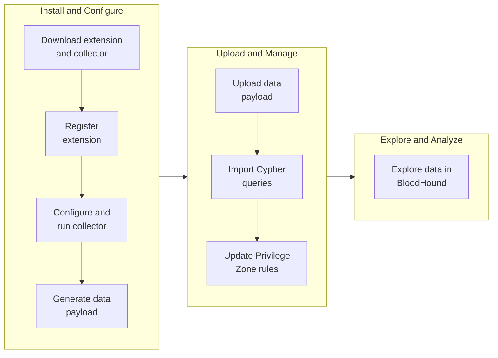

<Callout icon="bullhorn" color="#FFC107">Extension-based data ingestion is available under early access.</Callout>

When OpenGraph was introduced in BloodHound v8.0.0, it supported a generic data ingestion model that enabled rapid iteration and flexibility for early OpenGraph projects. This model required data payloads to conform to basic node, edge, and metadata schemas only.

To enable enhanced features and improve consistency across OpenGraph projects, BloodHound now supports an extension-based data ingestion model. This model allows you to register and manage the structures that shape your OpenGraph data in BloodHound. It requires data payloads to conform to an extension schema.

<Note>BloodHound still supports generic data ingestion. For new OpenGraph projects and updates to existing projects, use extension-based data ingestion to take advantage of enhanced platform capabilities.</Note>

## Key concepts

OpenGraph extensions are defined by a schema that specifies the structure and behavior of OpenGraph data for a specific identity provider, cloud service, or other platform.

Review the following key concepts to understand how extension-based data ingestion works in BloodHound:

| Concept | Description |
|---|---|
| **Extension schema** | A schema that defines the structure and behavior of OpenGraph data, including source, custom node and edge definitions, environment identification, and findings. |
| **Data payload** | The extension-based or generic data generated by an OpenGraph collector that you upload to BloodHound. |
| **Extension-based data** | Data payloads that conform to an extension schema, enabling enhanced features and support in BloodHound. |
| **Generic data** | Data payloads that conform to basic OpenGraph node, edge, and metadata schemas only. |
| **Collector** | A tool that authenticates to a third-party platform and generates a data payload that BloodHound can ingest. |

<Tip>Any OpenGraph collector can leverage extension-based data ingestion by updating its data payloads to conform to an extension schema. See OktaHound for an example. For collectors that have not yet been updated, you can continue to upload generic data payloads while working with the extension author to update your collector and data payloads.</Tip>

## Enhanced features

The extension schema enables enhanced features for OpenGraph data in BloodHound that are not available for generic data.

The following table summarizes the key features enabled by extension-based data ingestion and their availability in Community and Enterprise editions of BloodHound:

| Feature |||
|---|---|---|
| Pathfinding | <Icon icon="square-check" iconType="solid" color="#22c55e"/> | <Icon icon="square-check" iconType="solid" color="#22c55e"/> |
| Environment filtering | <Icon icon="square-check" iconType="solid" color="#22c55e"/> | <Icon icon="square-check" iconType="solid" color="#22c55e"/> |
| Custom node icons and colors | <Icon icon="square-check" iconType="solid" color="#22c55e"/> (API-only) | <Icon icon="square-check" iconType="solid" color="#22c55e"/> (schema-defined) |
| Findings and remediation | <Icon icon="square-xmark" iconType="solid" color="#ef4444"/> | <Icon icon="square-check" iconType="solid" color="#22c55e"/> |

<Tip>BloodHound supports extension-specific [Cypher queries](/analyze-data/explore/cypher-search) that you can import separately. This allows extension authors to provide curated queries that you can use to perform general searches and create [Cypher-based](/analyze-data/privilege-zones/rules#cypher) rules for Privilege Zones.</Tip>

## Workflow

The general workflow for extension-based data ingestion involves three main stages that include different steps.

Not all steps are required (for example, uploading Cypher queries and creating Privilege Zone rules are optional), and the workflow is not strictly linear. However, the following diagram provides a high-level overview of the recommended workflow for extension-based data ingestion in BloodHound:

## Before you begin

Complete the following steps before registering an extension or uploading extension-based data:

<Steps>
	<Step title="Get extension artifacts">
		How you obtain extensions and collectors depends on your edition of BloodHound:

		- **BloodHound Community** users can download and use Community extensions and collectors from public GitHub repositories

		- **BloodHound Enterprise** customers can use both Community and Enterprise extensions and collectors; contact your Technical Account Manager to obtain Enterprise versions
	</Step>
	<Step title="Review prerequisites">
		After you obtain an extension and collector, review the prerequisites in the extension-specific setup documentation.
		
		For example, review collector permissions and required platform configurations, such as API service application registration.
	</Step>
	<Step title="Confirm role access">
		Confirm that your [role](/manage-bloodhound/auth/users-and-roles#user-role-definitions) includes extension management permissions.
	</Step>
	<Step title="Validate version compatibility">
		Verify the extension and collector versions are compatible with each other and with the version of BloodHound running on your tenant.
	</Step>
</Steps>
