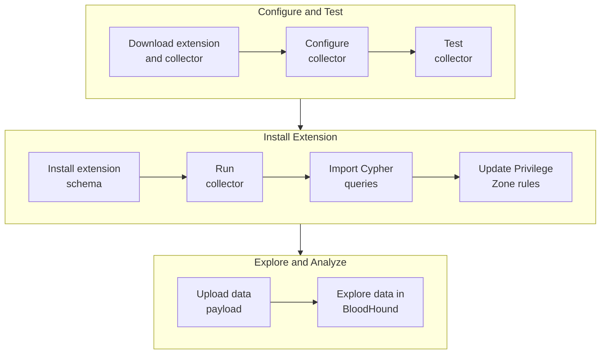
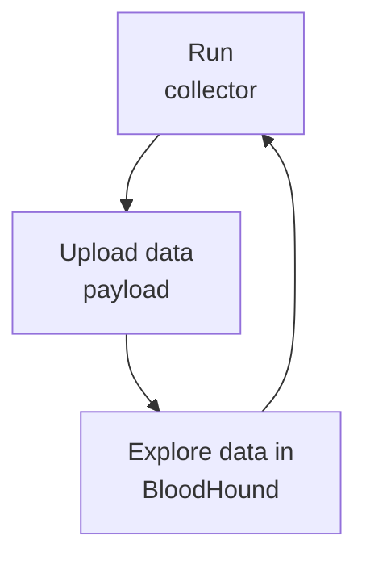

OpenGraph extensions expand BloodHound's ability to map attack paths beyond Microsoft platforms to other identity providers, developer infrastructure, and device management platforms. For example:

- [OktaHound](/opengraph/extensions/oktahound/overview)
- [GitHound](/opengraph/extensions/githound/overview)
- [JamfHound](/opengraph/extensions/jamfhound/overview)

<Tip>See the [OpenGraph Library](/opengraph/library) for a list of more OpenGraph extensions and collectors.</Tip>

How extensions structure data has important implications for how you explore and analyze it in BloodHound, so it's important to understand the differences between **generic** and **structured** graphs and how to manage extensions effectively.

<Callout icon="bullhorn" color="#FFC107">
Structured graphs are available under [early access](https://pages.specterops.io/lp-WEB-260316-BHE-OpenGraph.html).
</Callout>

## Generic graphs

When OpenGraph was introduced in BloodHound v8.0.0, it required data payloads to conform to basic node, edge, and metadata schemas only and produced **generic graphs** to support basic exploration through Cypher queries (and later, node search).

This enabled rapid iteration and flexibility for early OpenGraph extensions. However, it also meant that OpenGraph data was not integrated with other BloodHound features and capabilities.

## Structured graphs

Extension developers can now create **extension schemas** to enable enhanced features and capabilities for OpenGraph data.

<Callout icon="bulldozer" iconType="solid" color="#FFC107">
The existing extension [developer documentation](/opengraph/schema) explains the requirements for generic graphs only. Updates for structured graphs are in progress.
</Callout>

After you upload a schema _and_ a data payload that conforms to it, BloodHound produces a **structured graph** that provides enhanced features compared to generic graphs, such as:

| Feature | Release status | Structured Graph | Generic Graph |
|---|---|---|---|
| Custom node icons and colors | Early access | <Icon icon="square-check" iconType="solid" color="#22c55e"/> (schema-based) | <Icon icon="square-check" iconType="solid" color="#22c55e"/> (API only) |
| Pathfinding | Early access | <Icon icon="square-check" iconType="solid" color="#22c55e"/> | <Icon icon="square-xmark" iconType="solid" color="#ef4444"/> |
| Structured entity panel | Early access | <Icon icon="square-check" iconType="solid" color="#22c55e"/> | <Icon icon="square-xmark" iconType="solid" color="#ef4444"/> |
| Database management | Early access | <Icon icon="square-check" iconType="solid" color="#22c55e"/> | <Icon icon="square-xmark" iconType="solid" color="#ef4444"/> |
| Environment filtering | Coming soon | <Icon icon="square-check" iconType="solid" color="#22c55e"/> | <Icon icon="square-xmark" iconType="solid" color="#ef4444"/> |
| Findings1 | Coming soon | <Icon icon="square-check" iconType="solid" color="#22c55e"/> | <Icon icon="square-xmark" iconType="solid" color="#ef4444"/> |
| Remediations1 | Coming soon | <Icon icon="square-check" iconType="solid" color="#22c55e"/> | <Icon icon="square-xmark" iconType="solid" color="#ef4444"/> |
| Posture metrics2 | Coming soon | <Icon icon="square-check" iconType="solid" color="#22c55e"/> | <Icon icon="square-xmark" iconType="solid" color="#ef4444"/> |

<Note>
  1 Extensions that include findings and remediations work in both Community and Enterprise, but are visible in Enterprise only.
  
  2 Posture metrics are available in BloodHound Enterprise only.
</Note>

## Key terms

See the following table for important terms and definitions related to OpenGraph extensions:

| Term | Definition |
|---|---|
| **Extension** | A modular package of OpenGraph components, including a schema, collector, Cypher queries, and findings. |
| **Extension schema** | A schema that fully integrates OpenGraph models and data, allowing them to use a broader set of BloodHound features. BloodHound Community and BloodHound Enterprise use the same schema format. |
| **Collector** | A tool that authenticates to a third-party platform and generates a data payload that BloodHound can ingest. |
| **Data payload** | The data generated by an OpenGraph collector that you upload to BloodHound. |
| **Structured graph** | OpenGraph data associated with an installed extension schema. Structured graphs are fully integrated with BloodHound's features and functionality. |
| **Generic graph** | OpenGraph data conforming to basic node, edge, and metadata schemas only, with no associated extension schema. |

## Manage extensions

Use the **OpenGraph Management** page in BloodHound to upload new extension schemas, view active extensions, and delete extensions that you no longer need.

<Note>
Only users with the Administrator [role](/manage-bloodhound/auth/users-and-roles#user-role-definitions) can manage extensions.
</Note>

### Before you begin

Complete the following steps before installing an extension or uploading structured graph data:

<Steps>
	<Step title="Get extension artifacts">
		How you obtain extensions and collectors depends on your BloodHound edition and how they are distributed:

		- **BloodHound Community** users can download and use publicly available extensions and collectors from GitHub repositories.

		- **BloodHound Enterprise** customers can use publicly available extensions and collectors and may also have access to additional SpecterOps-provided extensions and collectors; contact your Technical Account Manager for availability.
	</Step>
	<Step title="Review prerequisites">
		After you obtain an extension and collector, review the prerequisites in the extension-specific setup documentation.
		
		For example, review collector permissions and required platform configurations, such as API service application registration.
	</Step>
</Steps>

### Workflow

The general workflow for working with extensions and structured graphs includes a one-time initial setup (Administrators only) followed by a recurring operational loop (Administrators and users) to keep extension data current and take advantage of enhanced features in BloodHound.

#### Initial setup

The following diagram provides a high-level overview of the recommended workflow to prepare BloodHound for producing structured graphs from OpenGraph extensions.

<Note>
The initial setup workflow is not strictly linear and not all steps are required. For example, uploading Cypher queries and creating Privilege Zone rules are optional.
</Note>

#### Operational loop

After initial setup, repeat the following steps as needed to keep your extension data current:

### Install an extension

Installing an extension involves uploading the extension schema to BloodHound, which validates the schema and makes it available for use with compatible data payloads.

After installing the schema, BloodHound produces structured graphs for data payloads that conform to it.

<Steps>
  <Step title="Open the OpenGraph Management page">
	In the left menu, click **Administration** > **OpenGraph Management**.
  </Step>
  <Step title="Upload the extension schema">
	1. Click **Upload File** to open a file system dialog or drag and drop an extension schema file onto the canvas.

	1. Click **Upload** to begin the schema registration and validation process.

	   
  </Step>
  <Step title="Confirm installation">
	Confirm the extension appears in the list of active extensions.

	<Frame>
	  
	</Frame>
  </Step>
</Steps>

### Delete an extension

Deleting an extension removes the extension schema from BloodHound. Associated data reverts to generic graphs — structured graph capabilities are no longer available, but the underlying data remains in BloodHound and can still be explored in [Search](/analyze-data/explore/search#search).

If you want to delete the data payloads associated with an extension, you can do so separately on the **Database Management** page.

To delete an extension schema, click the <Icon icon="trash"/> (trash) icon next to the extension in the list of active extensions and confirm the deletion in the prompt.

<Note>You cannot delete built-in extensions that come with BloodHound, but you can delete custom extensions that you have uploaded.</Note>

### Update an extension

Collectors and extension schemas are versioned separately to allow for more flexible updates, but this requires coordination to maintain compatibility and support. Follow these guidelines for managing updates:

- Do not update collectors independently without confirming extension schema compatibility.
- Update collectors and extension schemas together whenever possible.
- If you use SpecterOps-provided extensions or collectors, coordinate update cycles with your Technical Account Manager.

To update an extension, upload the new version using the same process as installing a new extension. BloodHound validates the new schema and replaces the old version with the new one.

## Upload data

After an Administrator installs an extension, users can upload data payloads that conform to the extension schema and take advantage of structured graph capabilities in BloodHound. Follow these steps to upload and explore structured graph data:

<Steps>
  <Step title="Upload data">
	Upload a data payload that conforms to the installed extension schema.

	1. In the left menu, click <Icon icon="arrow-up-from-bracket"/> **Quick Upload**.

	1. Click the **Upload File** canvas to open a file system dialog or drag and drop the data payload file(s) onto the canvas.

	1. Click **Upload** to begin the data ingestion and validation process.

	   <Tip>You can monitor the progress of the upload and validation process on the [File Ingest](/collect-data/enterprise-collection/monitor#file-ingest) page.</Tip>
  </Step>

  <Step title="Explore and analyze">
    Use the enhanced features enabled by the extension schema to explore and analyze your OpenGraph data in BloodHound.

	| Feature | Description |
	|---|---|
	| Pathfinding | Use [Pathfinding](/analyze-data/explore/search#pathfinding) to identify attack paths and analyze relationships between entities in your environment |
	| Cypher queries | [Import](/analyze-data/explore/cypher-search#import-and-export) and use extension-specific Cypher queries to perform general searches and create Privilege Zone rules |
	| Environment filtering | Filter on schema-defined environments to focus on specific contexts in the **Attack Paths**, **Posture**, and **Zone Builder** pages |
	| Findings and remediation | Use findings and remediation information to prioritize and address issues in your environment |
  </Step>
</Steps>