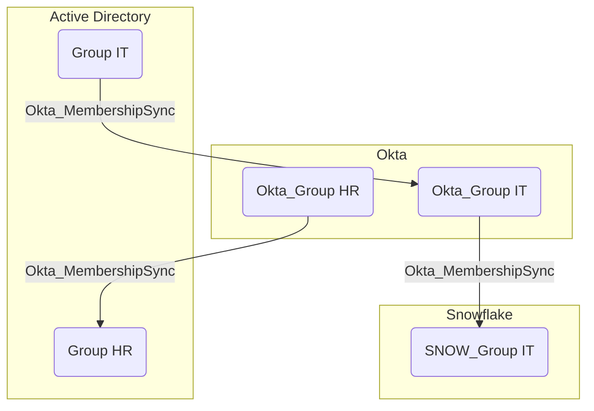

## Edge Schema

- Source: [Group](https://bloodhound.specterops.io/resources/nodes/group), [Okta_Group](../nodes/okta_group), [AZGroup](https://bloodhound.specterops.io/resources/nodes/az-group), [SNOW_Group](https://github.com/SpecterOps/SnowHound)
- Destination: [Okta_Group](../nodes/okta_group), [Group](https://bloodhound.specterops.io/resources/nodes/group), [SNOW_Group](https://github.com/SpecterOps/SnowHound)
- Traversable: ✅

## General Information

The traversable hybrid `Okta_MembershipSync` edges represent the synchronization relationships between groups in external directories and their corresponding groups in Okta:

