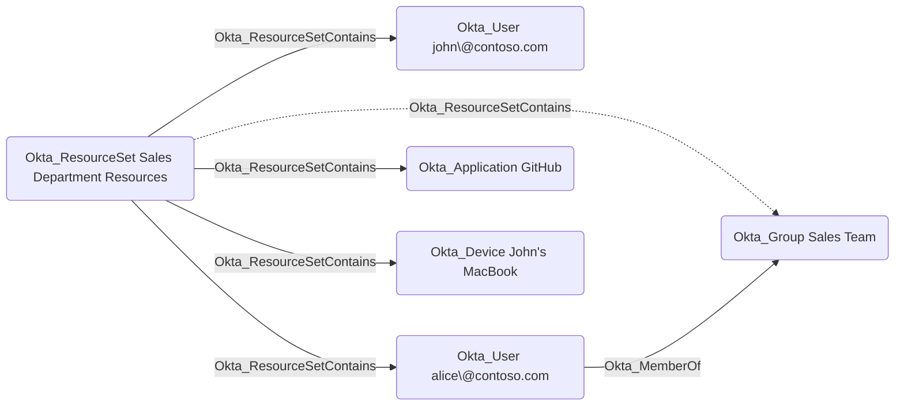

## Edge Schema

- Source: [Okta_ResourceSet](/opengraph/extensions/oktahound/reference/nodes/okta_resourceset)
- Destination: [Okta_User](/opengraph/extensions/oktahound/reference/nodes/okta_user), [Okta_Group](/opengraph/extensions/oktahound/reference/nodes/okta_group), [Okta_Application](/opengraph/extensions/oktahound/reference/nodes/okta_application), [Okta_ApiServiceIntegration](/opengraph/extensions/oktahound/reference/nodes/okta_apiserviceintegration), [Okta_Device](/opengraph/extensions/oktahound/reference/nodes/okta_device), [Okta_AuthorizationServer](/opengraph/extensions/oktahound/reference/nodes/okta_authorizationserver), [Okta_IdentityProvider](/opengraph/extensions/oktahound/reference/nodes/okta_identityprovider), [Okta_Policy](/opengraph/extensions/oktahound/reference/nodes/okta_policy)
- Traversable: ✅

## General Information

The traversable `Okta_ResourceSetContains` edges represent the membership relationships between resource sets and their member entities in Okta:

Note that users can also be members of resource sets indirectly through group memberships.
The intermediate group will not appear in the graph, but the user membership will be resolved by OktaHound.
