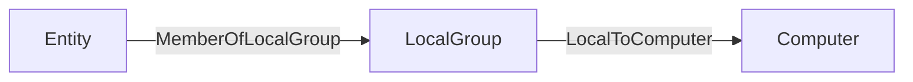

# Schema

In this section, you will find all the information to create a JSON file that BloodHound can ingest and use to display your Nodes and Edges.

The most up-to-date JSON Schema can always be found in our CE repository. Currently, the location of the node and edge schema files in our source code can be found [here](https://github.com/SpecterOps/BloodHound/tree/main/cmd/api/src/services/upload/jsonschema).

# Ingesting Generic Formatted Data

## File Requirements

Acceptable formats: `.json`, `.zip`

You can mix file types in a single upload (e.g. Sharphound + Generic).

Compressed ZIPs containing multiple file types are supported.

## JSON Format

The standard BloodHound UI upload screen now accepts files in a generic format. You can continue using it as before.

At minimum, your JSON file should have these elements:

```json
{
  "graph": {
    "nodes": [],
    "edges": []
  }
}
```

The `nodes` and `edges` must conform to our JSON Schema, see details below. The validation of the data occurs at upload time.

When ingest completes, the generic data will be available via **Cypher search ONLY**. Generic data is not searchable via the pathfinding feature (yet).

**Entity Panels**: clicking on a generic node or edge will only render the entity’s property bag. At this time there is no support for defining entity panels for generic entities.

## Nodes

### Property Rules

- Properties must be primitive types or arrays of primitive types.

- Nested objects and arrays of objects are not allowed.

- Arrays must be homogeneous (e.g. all strings or all numbers).

- An array of kind labels for the node. The first element is treated as the node's primary kind and is used to determine which icon to display in the graph UI. This primary kind is only used for visual representation and has no semantic significance for data processing.

- Property names must be lowercase. Property names in BloodHound are case-sensitive, which means `objectid` and `ObjectID` are treated as two distinct properties on the same node. This can cause issues when parsing API responses in languages that treat JSON keys as case-insensitive (for example, PowerShell and some .NET-based tools).

  <Warning>
    A future release will enforce lowercase property names. To avoid breaking
    changes, adopt lowercase property names now.
  </Warning>

#### Reserved Property: `objectid`

The property name `objectid` is reserved and **must not** be included in the `properties` object of a node definition.

In the BloodHound data model, the top-level `id` field serves as the unique identifier for the node.

Upon ingestion, this `id` value is automatically mapped and stored internally as the `objectid` property. Explicitly defining `objectid` within the `properties` map creates a redundant conflict that is unsupported. To ensure successful ingestion, remove any `objectid` keys from your node's `properties` object and rely solely on the root-level `id` field for identification.

### Node JSON

The following is the <a href="/assets/opengraph/opengraph-node.json" download>JSON schema</a> that all nodes must conform to.

```json
{
  "title": "Generic Ingest Node",
  "description": "A node used in a generic graph ingestion system. Each node must have a unique identifier (`id`) and at least one kind describing its role or type. Nodes may also include a `properties` object containing custom attributes.",
  "type": "object",
  "$defs": {
    "property_map": {
      "type": ["object", "null"],
      "description": "A key-value map of entity attributes. Values must not be objects. If a value is an array, it must contain only primitive types (e.g., strings, numbers, booleans) and must be homogeneous (all items must be of the same type).",
      "additionalProperties": {
        "anyOf": [
          { "type": "string" },
          { "type": "number" },
          { "type": "boolean" },
          {
            "type": "array",
            "anyOf": [
              { "items": { "type": "string" } },
              { "items": { "type": "number" } },
              { "items": { "type": "boolean" } }
            ]
          }
        ]
      },

      "not": {
        "required": ["objectid"]
      }
    }
  },
  "properties": {
    "id": {
      "type": "string"
    },
    "properties": {
      "$ref": "#/$defs/property_map"
    },
    "kinds": {
      "type": ["array"],
      "items": { "type": "string" },
      "minItems": 0,
      "maxItems": 3,
      "description": "An array of kind labels for the node. The first element is treated as the node's primary kind and is used to determine which icon to display in the graph UI. This primary kind is only used for visual representation and has no semantic significance for data processing."
    }
  },
  "required": ["id", "kinds"],
  "examples": [
    {
      "id": "user-1234",
      "kinds": ["Person"]
    },
    {
      "id": "device-5678",
      "properties": {
        "manufacturer": "Brandon Corp",
        "model": "4000x",
        "is_active": true,
        "rating": 43.5
      },
      "kinds": ["Device", "Asset"]
    },
    {
      "id": "location-001",
      "properties": null,
      "kinds": ["Location"]
    }
  ]
}
```

## Edges

Edge `kind` values must contain only letters (`A-Z`, `a-z`), numbers (`0-9`), and underscores (`_`).

BloodHound validates edge kinds at upload time. If any edge kind includes spaces, dashes (`-`), backticks, or other special characters, the file upload fails.

We recommend using PascalCase (for example, `AdminTo`, `HasSession`) for readability and consistency.

Neo4j Cypher allows many special characters in symbolic names when the name is enclosed in backticks. BloodHound OpenGraph ingest is more restrictive: edge `kind` values must match `^[A-Za-z0-9_]+$`, so upload validation rejects backtick-escaped names, spaces, dashes, and other special characters.

See Neo4j [Escaping rules for symbolic names](https://neo4j.com/docs/cypher-manual/current/syntax/naming/#symbolic-names-escaping-rules) for additional naming guidance.

### Edge Kind Validation

BloodHound enforces this pattern for edge kinds:

```text
^[A-Za-z0-9_]+$
```

**Valid examples**

- `AdminTo`
- `HasSession`
- `AZMGGrantRole`
- `Edge_1`

**Invalid examples**

- `Admin-To`
- `Has Session`
- ``Has`Session``
- `Has$Session`

### Edge Endpoint Matching

Edges in OpenGraph Ingest define relationships between nodes by specifying a `start` and an `end` point. Each endpoint can be resolved using one of two distinct matching strategies, controlled by the `match_by` field. This flexibility allows you to link nodes based on their unique database identifiers or by dynamically finding them based on specific attribute values.

#### Performance Costs

Matching edge endpoints in OpenGraph Ingest by the `match_by` `property` strategy will suffer from lower performance than default `match_by` `id` strategy. It is advised that users only exercise `match_by` `property` when no other method for matching by a node's identifier is viable.

#### Edge Endpoint Matching via Identifier

This is the default and most common method for defining edges. It resolves the endpoint by looking up a node using its unique internal ID or its human-readable name.

To use this strategy, set the `match_by` property to either `"id"` or `"name"` (note: `"name"` is deprecated and will be removed in future versions; using `"property"` with a single equality matcher is the recommended approach for name-based lookups).

- **`match_by`:** Set to `"id"` to match the node's unique object identifier, or `"name"` to match the node's name string.
- **`value`:** A required string containing the specific ID or name of the target node.
- **`kind` (Optional):** You may constrain the lookup to ensure the found node belongs to a specific type. For example, setting `kind: "User"` ensures that even if a name exists across multiple entity types, only the one classified as a `User` is selected.
- **`property_matchers`:** Not used in this mode. If provided alongside `match_by: "id"`, validation will fail.

**Example:**
Linking a specific user to a server using their unique IDs:

```json
{
  "start": {
    "match_by": "id",
    "value": "user-12345"
  },
  "end": {
    "match_by": "id",
    "value": "server-98765"
  }
}
```

#### Edge Endpoint Matching via Property Match

Use this strategy when you do not know the unique ID of the target node but can identify it through one or more known attributes (e.g., a username, email address, hostname, or custom property). This method allows for dynamic resolution based on data available at ingestion time.

To use this strategy, set the `match_by` property to `"property"`.

- **`match_by`:** Must be set to `"property"`.
- **`property_matchers`:** A required array of objects defining the criteria to find the node. Each object must include:
  - `key`: The name of the node property to check.
  - `operator`: Currently, only `"equals"` is supported.
  - `value`: The expected value for the property (string, number, or boolean).
  - _Note:_ You can provide multiple matchers in the array. The system will attempt to find a node that satisfies all conditions simultaneously.
- **`value`:** Not used in this mode. Providing a `value` field when `match_by` is `"property"` will cause validation errors.
- **`kind` (Optional):** Similar to identifier matching, you can restrict the search to nodes of a specific kind to avoid ambiguity.

**Example:**
Linking a user to a server by matching the user's `username` property and the server's `hostname` property:

```json
{
  "start": {
    "match_by": "property",
    "property_matchers": [
      {
        "key": "username",
        "operator": "equals",
        "value": "alice.smith"
      },
      {
        "key": "active",
        "operator": "equals",
        "value": true
      }
    ],
    "kind": "User"
  },
  "end": {
    "match_by": "property",
    "property_matchers": [
      {
        "key": "hostname",
        "operator": "equals",
        "value": "db-prod-01"
      }
    ]
  }
}
```

### Edge JSON

The following is the <a href="/assets/opengraph/opengraph-edge.json" download>JSON schema</a> that all edges must conform to.

If an edge kind does not meet the allowed pattern, BloodHound returns a schema validation error and rejects the upload.

```json
{
  "title": "Generic Ingest Edge",
  "description": "Defines an edge between two nodes in a generic graph ingestion system. Each edge specifies a start and end node using either a unique identifier (id) or a name-based lookup. A kind is required to indicate the relationship type. Optional properties may include custom attributes. You may optionally constrain the start or end node to a specific kind using the kind field inside each reference.",
  "type": "object",
  "$defs": {
    "property_map": {
      "type": ["object", "null"],
      "description": "A key-value map of edge attributes. Values must not be objects. If a value is an array, it must contain only primitive types (e.g., strings, numbers, booleans) and must be homogeneous (all items must be of the same type).",
      "additionalProperties": {
        "anyOf": [
          { "type": "string" },
          { "type": "number" },
          { "type": "boolean" },
          {
            "type": "array",
            "anyOf": [
              { "items": { "type": "string" } },
              { "items": { "type": "number" } },
              { "items": { "type": "boolean" } }
            ]
          }
        ]
      }
    },
    "endpoint": {
      "type": "object",
      "properties": {
        "match_by": {
          "type": "string",
          "enum": ["id", "name", "property"],
          "default": "id",
          "description": "Whether to match the start node by its unique object ID or by a series of property matches. Note that the name value here is deprecated and will be removed in future versions. Users are advised to use the multi-property match strategy moving forward."
        },
        "property_matchers": {
          "type": "array",
          "minItems": 1,
          "items": {
            "type": "object",
            "properties": {
              "key": {
                "type": "string"
              },
              "operator": {
                "type": "string",
                "enum": ["equals"]
              },
              "value": {
                "type": ["string", "number", "boolean"]
              }
            },
            "required": ["key", "operator", "value"]
          }
        },
        "value": {
          "type": "string",
          "description": "The value used for matching — either an object ID or a name, depending on match_by."
        },
        "kind": {
          "type": "string",
          "description": "Optional kind filter; the referenced node must have this kind."
        }
      },
      "if": {
        "allOf": [
          {
            "properties": {
              "match_by": {
                "type": "string",
                "const": "property"
              }
            }
          },
          {
            "not": {
              "properties": {
                "match_by": {
                  "type": "null"
                }
              }
            }
          }
        ]
      },
      "then": {
        "required": ["property_matchers"],
        "not": {
          "required": ["value"]
        }
      },
      "else": {
        "required": ["value"],
        "not": {
          "required": ["property_matchers"]
        }
      }
    }
  },
  "properties": {
    "start": {
      "$ref": "#/$defs/endpoint"
    },
    "end": {
      "$ref": "#/$defs/endpoint"
    },
    "kind": {
      "type": "string",
      "description": "Edge kind name must contain only alphanumeric characters and underscores.",
      "pattern": "^[A-Za-z0-9_]+$"
    },
    "properties": {
      "$ref": "#/$defs/property_map"
    }
  },
  "required": ["start", "end", "kind"],
  "examples": [
    {
      "start": {
        "match_by": "id",
        "value": "user-1234"
      },
      "end": {
        "match_by": "id",
        "value": "server-5678"
      },
      "kind": "has_session",
      "properties": {
        "timestamp": "2025-04-16T12:00:00Z",
        "duration_minutes": 45
      }
    },
    {
      "start": {
        "match_by": "property",
        "property_matchers": [
          {
            "key": "prop_1",
            "operator": "equals",
            "value": "value"
          }
        ]
      },
      "end": {
        "match_by": "id",
        "value": "server-5678"
      },
      "kind": "has_session",
      "properties": {
        "timestamp": "2025-04-16T12:00:00Z",
        "duration_minutes": 45
      }
    },
    {
      "start": {
        "match_by": "name",
        "value": "alice",
        "kind": "User"
      },
      "end": {
        "match_by": "name",
        "value": "file-server-1",
        "kind": "Server"
      },
      "kind": "accessed_resource",
      "properties": {
        "via": "SMB",
        "sensitive": true
      }
    },
    {
      "start": {
        "value": "admin-1"
      },
      "end": {
        "value": "domain-controller-9"
      },
      "kind": "admin_to",
      "properties": {
        "reason": "elevated_permissions",
        "confirmed": false
      }
    },
    {
      "start": {
        "match_by": "name",
        "value": "Printer-007"
      },
      "end": {
        "match_by": "id",
        "value": "network-42"
      },
      "kind": "connected_to",
      "properties": null
    }
  ]
}
```

### Post-processing

Post-processing in BloodHound refers to the analysis phase where the system creates certain edges after ingesting data to identify attack paths.

After ingesting data, BloodHound analyzes the graph state and adds edges it considers useful. BloodHound regenerates "post-processed" edges after it builds a complete graph. Before regenerating post-processed edges, BloodHound deletes any existing ones. As a result, BloodHound removes any post-processed edges that you add directly to an OpenGraph payload.

<Accordion title="Show post-processed edges">
BloodHound creates the following edges during post-processing:

- [`ADCSESC1`](/resources/edges/adcs-esc1)
- [`ADCSESC3`](/resources/edges/adcs-esc3)
- [`ADCSESC4`](/resources/edges/adcs-esc4)
- [`ADCSESC6a`](/resources/edges/adcs-esc6a)
- [`ADCSESC6b`](/resources/edges/adcs-esc6b)
- [`ADCSESC9a`](/resources/edges/adcs-esc9a)
- [`ADCSESC9b`](/resources/edges/adcs-esc9b)
- [`ADCSESC10a`](/resources/edges/adcs-esc10a)
- [`ADCSESC10b`](/resources/edges/adcs-esc10b)
- [`ADCSESC13`](/resources/edges/adcs-esc13)
- [`AddMember`](/resources/edges/add-member)
- [`AdminTo`](/resources/edges/admin-to)
- [`AZAddOwner`](/resources/edges/az-add-owner)
- [`AZMGAddMember`](/resources/edges/az-mg-add-member)
- [`AZMGAddOwner`](/resources/edges/az-mg-add-owner)
- [`AZMGAddSecret`](/resources/edges/az-mg-add-secret)
- [`AZMGGrantAppRoles`](/resources/edges/az-mg-grant-app-roles)
- [`AZMGGrantRole`](/resources/edges/az-mg-grant-role)
- [`AZRoleApprover`](/resources/edges/az-role-approver)
- [`CanPSRemote`](/resources/edges/can-ps-remote)
- [`CanRDP`](/resources/edges/can-rdp)
- [`CoerceAndRelayNTLMToADCS`](/resources/edges/coerce-and-relay-ntlm-to-adcs)
- [`CoerceAndRelayNTLMToLDAP`](/resources/edges/coerce-and-relay-ntlm-to-ldap)
- [`CoerceAndRelayNTLMToLDAPS`](/resources/edges/coerce-and-relay-ntlm-to-ldaps)
- [`CoerceAndRelayNTLMToSMB`](/resources/edges/coerce-and-relay-ntlm-to-smb)
- [`DCSync`](/resources/edges/dc-sync)
- [`EnrollOnBehalfOf`](/resources/edges/enroll-on-behalf-of)
- [`EnterpriseCAFor`](/resources/edges/enterprise-ca-for)
- [`ExecuteDCOM`](/resources/edges/execute-dcom)
- [`ExtendedByPolicy`](/resources/edges/extended-by-policy)
- [`GoldenCert`](/resources/edges/golden-cert)
- [`HasTrustKeys`](/resources/edges/has-trust-keys)
- [`IssuedSignedBy`](/resources/edges/issued-signed-by)
- [`Owns`](/resources/edges/owns)
- [`OwnsLimitedRights`](/resources/edges/owns-limited-rights)
- [`ProtectAdminGroups`](/resources/edges/protect-admin-groups)
- [`SyncLAPSPassword`](/resources/edges/sync-laps-password)
- [`SyncedToADUser`](/resources/edges/synced-to-ad-user)
- [`SyncedToEntraUser`](/resources/edges/synced-to-entra-user)
- [`TrustedForNTAuth`](/resources/edges/trusted-for-nt-auth)
- [`WriteOwner`](/resources/edges/write-owner)
- [`WriteOwnerLimitedRights`](/resources/edges/write-owner-limited-rights)

</Accordion>

You can work around this behavior by including the supporting edges that cause the post-processing step to generate the edge that you want.

For example, if you include an `AdminTo` edge directly in your OpenGraph payload, BloodHound removes it during post-processing and the edge does not persist in the final graph as expected. Instead of adding `AdminTo` edges directly, include the supporting edges that cause the post-processor to generate the `AdminTo` edge. The common pattern that triggers the creation of the `AdminTo` edge is:



See the following example OpenGraph payload that produces the effect:

```json
{
  "graph": {
    "nodes": [
      {
        "id": "TESTNODE",
        "kinds": ["User"]
      }
    ],
    "edges": [
      {
        "start": {
          "match_by": "id",
          "value": "TESTNODE"
        },
        "end": {
          "match_by": "id",
          "value": "S-1-5-21-2697957641-2271029196-387917394-2171-544"
        },
        "kind": "MemberOfLocalGroup"
      }
    ]
  }
}
```

## Optional Metadata Field

You can optionally include a metadata object at the top level of your JSON payload. This metadata currently supports a single field:

    - `source_kind`: a string that applies to all nodes in the file, used to attribute a source to ingested nodes (e.g.  Github, Snowflake, MSSQL). This is useful for tracking where a node originated. We internally use this concept already for AD/Azure, using the labels “Base” and “AZBase” respectively.

Example:

```json
{
  "metadata": {
    "source_kind": "GHBase"
  },
  "graph": {
    "nodes": [],
    "edges": []
  }
}
```

If present, the `source_kind` will be added to the `kinds` list of all nodes in the file during ingest. This feature is optional.

## Minimal Working JSON

The following is a minimal example payload that conforms to the node and edge schemas above. You can use this as a starting point to build your own OpenGraph. Copy and paste the following example into a new `.json` file or <a href="/assets/opengraph/opengraph-minimal.json" download>download this example file</a>.

<Tip>
  When working with JSON files, use a plain text editor and UTF-8 encoding. Some
  text editors may introduce unexpected, non-standard characters that can cause
  parsing errors. It's always a good idea to validate your JSON with a
  [linter](https://jsonlint.com/) before uploading it to BloodHound.
</Tip>

```json
{
  "graph": {
    "nodes": [
      {
        "id": "123",
        "kinds": ["Person"],
        "properties": {
          "displayname": "bob",
          "property": "a",
          "objectid": "123",
          "name": "BOB"
        }
      },
      {
        "id": "234",
        "kinds": ["Person"],
        "properties": {
          "displayname": "alice",
          "property": "b",
          "objectid": "234",
          "name": "ALICE"
        }
      }
    ],
    "edges": [
      {
        "kind": "Knows",
        "start": {
          "value": "123",
          "match_by": "id"
        },
        "end": {
          "value": "234",
          "match_by": "id"
        }
      }
    ]
  }
}
```

To test the ingestion in your BloodHound instance, navigate to **Explore** → **Cypher**. Enter the following query and hit `Run`:

```cypher
match p=()-[:Knows]-()
return p
```

You should get something that looks like this:

Knows->Alice" />
